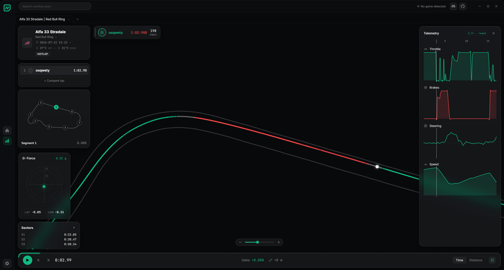
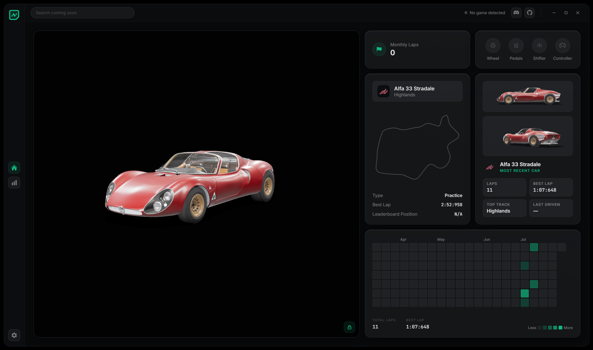

<div align="center">


[](https://github.com/Novent-Project/Novent)
[](https://github.com/Novent-Project/Novent/releases)
[](https://github.com/Novent-Project/Novent/graphs/contributors)
[](https://discord.gg/QhfZyrcfSE)

</div>

Novent detects your session, records every lap automatically, and turns the data into a race-engineer-grade analysis suite, wrapped in a lightweight Tauri app.

---

## Screenshots

<div align="center">





</div>

---

## Features

- **Automatic lap recording**: watches AC's shared memory and captures every lap, including inputs, speed, gear, RPM, G-forces, and position
- **Lap analysis**: playback with scrubbing, track map with corner segments, delta-time trace, telemetry graphs, G-force and sector widgets
- **Reference laps**: compare up to six laps with color-coded ghosts, gaps, and per-lap sector columns
- **Sessions & favorites**: laps grouped by session, with a pinned Favorites collection across all cars and tracks
- **3D car showroom**: renders your last-driven car's actual KN5 model; lockable to a snapshot for zero GPU use
- **Dashboard**: car spotlight renders, activity heatmap, peripheral detection, latest-session trace

---

## Requirements

- Point Novent at your game root folder in **Settings → Game Detection** (used for track boundaries and car models)

---

## Development

**Prerequisites:** [Rust](https://rustup.rs), [Node.js](https://nodejs.org), [pnpm](https://pnpm.io), [Python 3.13](https://www.python.org), and the [Tauri v2 prerequisites](https://tauri.app/start/prerequisites/).

```bash
git clone <repo-url>
cd Novent
pnpm install
pnpm tauri:dev
```

The Python backend runs as a bundled sidecar. After changing `backend.py`, rebuild it with PyInstaller and drop it into `src-tauri/binaries/`:

```bash
pip install pyinstaller fastapi uvicorn h5py numpy psutil
pyinstaller --onefile --console --name backend-x86_64-pc-windows-msvc backend.py
copy dist\backend-x86_64-pc-windows-msvc.exe src-tauri\binaries\
```

---

## Stack

| | |
|---|---|
| [Tauri v2](https://tauri.app) | Native app shell, tray, sidecar management |
| [Svelte 5](https://svelte.dev) + [SvelteKit 2](https://kit.svelte.dev) + [TypeScript](https://www.typescriptlang.org) | UI |
| [three.js](https://threejs.org) | KN5 car renderer (custom parser, DDS decoding, AC detail-map shaders) |
| [FastAPI](https://fastapi.tiangolo.com) + [NumPy](https://numpy.org) + [h5py](https://www.h5py.org) | Python telemetry backend (shared-memory reader, HDF5 lap storage, SQLite index) |
| [Vite](https://vitejs.dev) | Frontend bundler |

---

## License

Distributed under the [MIT License](./LICENSE).

---

## Disclaimer

Novent is an independent project and is not affiliated with Kunos Simulazioni or Assetto Corsa. Car models and textures are read from your local game installation and never redistributed.
